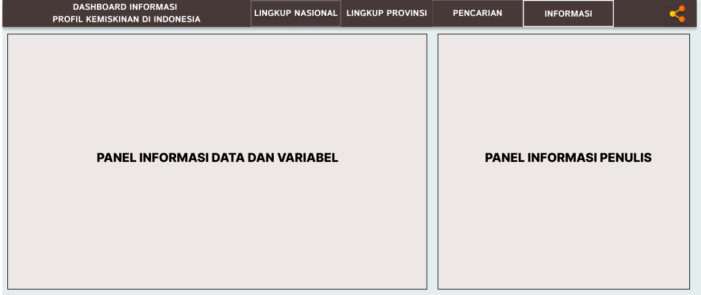

<h1 align="center">
  Pembangunan <i>Dashboard</i> Informasi Menggunakan <i>Library Flexdashboard R</i>  (Studi Kasus: Profil Kemiskinan di Indonesia Tahun 2021)
</h1>

<h3 align="center">Tautan dalam mengakses <i>dashboard</i>: https://raflizal17.github.io/Project-UAS-Visdat/ </h3>
 
<h2>Ringkasan Penelitian</h2>
<h3>1. Latar Belakang </h3>
  
 
&nbsp;&nbsp;&nbsp;&nbsp;&nbsp;Penelitian ini didasarkan pada tujuan SDG's pertama yaitu pengentasan kemiskinan (<i>Zero Poverty</i>) yang diharapkan tercapai pada tahun 2030. Masalah kemiskinan merupakan salah satu persoalan mendasar yang bersifat kompleks dan multidimensional sehingga sering dijadikan pusat perhatian bagi pemerintah setiap negara termasuk Pemerintah Indonesia. Pemerintah Indonesia sendiri memiliki tujuan nasional yang diatur dalam UUD 1945 yaitu mewujudkan masyarakat adil dan makmur. Pemerintah dalam mewujudkan tujuan tersebut harus merencanakan dan merealisasikan program-program pembangunan nasional dalam rangka pengentasan kemiskinan di masyarakat Indonesia secara tepat dan akurat. Salah satu aspek penting untuk mendukung keakuratan dan ketepatan kebijakan dalam melaksanakan pembangunan sebagai strategi penanggulangan kemiskinan yakni tersedianya akses data dan informasi mengenai potret kemiskinan secara aktual. Oleh sebab itu, ketersediaan sarana penyajian informasi dan kemudahan dalam mengakses data perlu diperhatikan agar dapat membantu pemerintah dalam menetapkan kebijakan yang terarah dan berkelanjutan. Sarana penyajian informasi yang umum digunakan pada lingkup organisasi/pemerintah adalah dalam bentuk rupa <i>dashboard</i>. Saat ini, teknologi <i>dashboard</i> sudah sangat pesat dan beragam jenisnya. Dengan memperhatikan perkembangan teknologi yang semakin cepat serta pentingnya kebutuhan informasi mengenai kondisi kemiskinan di tengah masyarakat, maka pemanfaatan <i>dashboard</i> sebagai media penyajian data dan informasi ini perlu digalakkan dalam menunjang kegiatan pelaporan atau diseminasi hasil dari suatu penelitian, survei maupun kajian ilmu lain. Oleh karena itu, penelitian ini akan menghasilkan <i>output</i> suatu <i>dashboard</i> informasi yang menyajikan profil kemiskinan di Indonesia tahun 2021 dengan tampilan yang menarik, lengkap dan akurat, serta memberikan kemudahan kepada pengguna dalam memahami data yang disajikan dengan pemilihan visualisasi data yang tepat. Dengan demikian, hasil yang diperoleh diharapkan dapat memfasilitasi para <i>stakeholder</i> sebagai pengguna data dalam memahami informasi terkait potret kemiskinan yang terjadi di Indonesia tahun 2021 sebagai acuan dalam merancang dan menerapkan kebijakan pembangunan nasional dengan tepat dan berdaya guna kepada masyarakat. 
   

  
<h3>2. Tujuan Penelitian</h3>
  

&nbsp;&nbsp;&nbsp;&nbsp;&nbsp;Penelitian ini memiliki dua tujuan yaitu: (1) membuat visualisasi dari hasil publikasi data yang dirilis oleh BPS terkait profil kemiskinan di Indonesia tahun 2021 dengan memanfaatkan berbagai <i>library</i> visualisasi data di R; (2) membangun <i>dashboard</i> informasi sebagai wadah penyajian data dan informasi mengenai profil kemiskinan di Indonesia tahun 2021 dengan menggunakan <i>Library Flexdashboard R</i> yang berbasis web responsif; dan (3) melakukan evaluasi terhadap dashboard informasi yang telah dibuat dengan menggunakan pengukuran <i>System User Scalabilty</i>(SUS)
  

  
<h3>3. Metode Penelitian</h3>
  <h4> A. Studi Literatur </h4>
  

&nbsp;&nbsp;&nbsp;&nbsp;&nbsp;Tahap awal penelitian ini adalah melakukan studi literatur dari penelitian lain yang berkenaan dengan pembangunan <i>dashboard</i> visualisasi data dan informasi menggunakan <i>Library Flexdashboard R</i>. Studi literatur penelitian ini diperoleh melalui jurnal dan artikel ilmiah yang membahas tentang teknik visualisasi data dan pembuatan <i>dashboard</i> informasi.
  

  <h4> B. Pengumpulan Data </h4>
  

&nbsp;&nbsp;&nbsp;&nbsp;&nbsp;Data yang akan digunakan merupakan indikator kemiskinan yang dirilis oleh BPS yang terdiri atas 5 variabel meliputi:
  <ol>
    <li>Variabel Jumlah Penduduk Miskin</li>
    <li>Variabel Persentase Penduduk Miskin</li>
    <li>Variabel Garis Kemiskinan</li>
    <li>Variabel Indeks Kedalaman Kemiskinan</li>
    <li>Variabel Indeks Keparahan Kemiskinan</li>
    <li>Variabel Indeks Gini (<i>Gini Ratio</i>)</li>
  </ol> 
Kelima variabel data yang dikumpulkan dari tahun 2011 hingga 2021, baik dalam lingkup nasional maupun lingkup provinsi. 
  

  <h4> C. Pengolahan Data </h4>
  

&nbsp;&nbsp;&nbsp;&nbsp;&nbsp;Pada proses pengolahan data dilakukan beberapa tahapan sebelum data divisualisasikan. Tahapan pengolahan data ini penting karena data-data yang telah dihimpun perlu disesuaikan dan diseleksi berdasarkan referensi waktu dan wilayah cakupan penelitian. Tahapan pengolahan data ini meliputi pembersihan data (<i>data cleaning</i>), identifikasi variabel, penyatuan data (<i>data integration</i>), perencanaan jenis visualisasi, dan konversi data (<i>data convertion</i>). Seluruh tahapan dalam pengolahan data dilakukan pada <i>Microsoft Office Excel</i> dan <i>R</i>.    
  

  <h4> D. Visualisasi Data </h4>
  

&nbsp;&nbsp;&nbsp;&nbsp;&nbsp;Pada tahapan ini, data yang sudah diolah akan dilakukan visualisasi sesuai dengan rencana jenis visualisasi yang telah ditetapkan sebelumnya. Alat atau tools dalam pembuatan visualisasi data ini menggunakan beberapa library visualisasi data di dalam koleksi modul R. Library tersebut antara lain <i>highcharter, DT, plotly, ggplot2, mapview,</i> dan lain-lain. Adapun dalam pemilihan warna dan tema grafik menggunakan library viridis untuk memberikan efek gradien warna pada chart visualisasi data tertentu yang memberikan penekanan atau maksud tertentu. Berikut ini rencana jenis visualisasi yang akan dibuat:
  <ul>
    <li>Visualisasi Teks Sederhana (<i>Simple Text</i>)</li>
    <li>Visualisasi <i>Bar Chart</i></li>
    <li>Visualisasi <i>Pie Chart</i>
    <li>Visualisasi <i>Line Chart</i></li>
    <li>Visualisasi Tabular (<i>Data Table</i>)</li>
    <li>Visualisasi Peta Tematik Interaktif (<i>Interactive Choropleth Map</i>)</li>
  </ul>
  

  
  <h4> E. <i>Design Dashboard</i></h4>
  
<i>Design Dashboard</i> dibuat menggunakan aplikasi <i>Figma</i>. Berikut ini tampilan <i>design dashboard</i> tiap halaman.

  <ol>
  <li><h5><i>Design Dashboard</i> Halaman Utama (Lingkup Nasional)</h5></li>
   </img>
  
  <li><h5><i>Design Dashboard</i> Halaman Kedua (Lingkup Provinsi)</h5></li>
   </img>
  
  <li><h5><i>Design Dashboard</i> Halaman Pencarian</h5></li>
   </img>
  
  <li><h5><i>Design Dashboard</i> Halaman Informasi</h5></li>
   </img>
  </ol>

  <h4> F. Perancangan <i>Dashboard</i></h4>
  

&nbsp;&nbsp;&nbsp;&nbsp;&nbsp;<i>Dashboard</i> yang efektif didesain dengan penuh cermat dan mempertimbangkan peran dari pengguna dalam pengambilan keputusan. Haryanti (2008) menjabarkan mengenai metodologi pembangunan dasbor terdiri atas 7 tahap, meliputi identifikasi kebutuhan, perencanaan, perancangan prototype, <i>review prototype</i>, implementasi, <i>deployment</i>, dan <i>maintenance</i>.

  
  <h4> G. Evaluasi Sistem</h4>
  

&nbsp;&nbsp;&nbsp;&nbsp;&nbsp;Evaluasi sistem yang digunakan menggunakan pengukuran dengan <i>System Usability Scale (SUS)</i>. Pengujian SUS dilakukan untuk mengukur tingkat kegunaan suatu aplikasi. SUS dilakukan dengan mengisi kuesioner yang terdiri atas 10 item pernyataan mengenai sistem yang dibangun. Pernyataan diukur menggunakan skala likert 1-5 dengan definisi sangat tidak setuju hingga sangat setuju. Dalam konteks ini, aplikasi yang akan dievaluasi berupa <i>dashboard</i> informasi profil kemiskinan Indonesia tahun 2021.
  

  
  <h4> H. Penyusunan Laporan</h4>
  

&nbsp;&nbsp;&nbsp;&nbsp;&nbsp;Tahap akhir dalam penelitian ini adalah melakukan penyusunan laporan. Laporan ini akan dibuat dalam format IEEE dengan menyesuaikan isi yang terdapat pada proposal penelitian dan hasil yang diperoleh dari pembuatan dashboard informasi mengenai profil kemiskinan di Indonesia tahun 2021 hingga proses publikasi ke dalam web server telah selesai dilakukan. 
  

  
  <h3>4. Hasil dan Pembahasan</h3>
  <h4>A. Hasil Tampilan <i>Dashboard</i> dan Visualisasi Data</h4>
    <ol type="1">
      <li><h5>Tampilan <i>Dashboard</i> Halaman Utama pada Sub-Menu 1</h5></li>
       </img>
      <li><h5>Tampilan <i>Dashboard</i> Halaman Utama pada Sub-Menu 2</h5></li>
       </img>
      <li><h5>Tampilan <i>Dashboard</i> Halaman Utama pada Sub-Menu 3</h5></li>
       </img>
      <li><h5>Tampilan <i>Dashboard</i> Halaman Utama pada Sub-Menu 4</h5></li>
       </img>
      <li><h5>Tampilan <i>Dashboard</i> Halaman Utama pada Sub-Menu 5</h5></li>
       </img>
      <li><h5>Tampilan <i>Dashboard</i> Halaman Kedua pada Sub-Menu 1</h5></li>
       </img>
      <li><h5>Tampilan <i>Dashboard</i> Halaman Kedua pada Sub-Menu 2</h5></li>
       </img>
      <li><h5>Tampilan <i>Dashboard</i> Halaman Kedua pada Sub-Menu 3</h5></li>
       </img>
      <li><h5>Tampilan <i>Dashboard</i> Halaman Kedua pada Sub-Menu 4</h5></li>
       </img>
      <li><h5>Tampilan <i>Dashboard</i> Halaman Pencarian</h5></li>
       </img>
      <li><h5>Tampilan <i>Dashboard</i> Halaman Pencarian dengan Mencoba Fitur Filter Data</h5></li>
       </img>
      <li><h5>Tampilan <i>Dashboard</i> Halaman Informasi</h5></li>
       </img>
    </ol>
    
 <h4>B. Evaluasi <i>Dashboard</i></h4>

 
&nbsp;&nbsp;&nbsp;&nbsp;&nbsp;<i>Dashboard</i> yang telah dibuat perlu dievaluasi kepada pengguna (<i>user</i>) agar dapat dinilai secara objektif. Penilaian evaluasi menggunakan pengukuran <i>System Usability Scale</i> (SUS). Ketika SUS digunakan, responden akan diminta untuk menilai sepuluh item pertanyaan dengan memilih salah satu jawaban dari lima tanggapan berkisar dari sangat setuju hingga sangat tidak setuju. Survei telah dilakukan untuk memperoleh nilai SUS untuk <i>dashboard</i> informasi profil kemiskinan Indonesia tahun 2021. Periode survei dilakukan selama 3 hari, yaitu 18-20 Juni 2022. Dari survei tersebut diperoleh jumlah responden sebanyak 89 orang. Gambar berikut merupakan visualisasi yang menggambarkan karakteristik responden berdasarkan kelompok pengguna yang mengikuti survei evaluasi <i>dashboard</i> informasi profil kemiskinan Indonesia tahun 2021.

 </img>

&nbsp;&nbsp;&nbsp;&nbsp;&nbsp;Responden yang menjadi sasaran survei merupakan kelompok pengguna dari kalangan masyarakat umum dan kelompok mahasiswa STIS. Jumlah responden dari kalangan masyarakat umum yaitu 39 orang, sedangkan responden dari kelompok mahasiswa STIS yaitu 50 orang. Jumlah responden tersebut sudah dirasa cukup untuk digunakan sebagai penilaian evaluasi pada <i>dashboard</i>. Setelah itu dilakukan penghitungan skor dengan aturan sebagai berikut:
Q_odd=(scale position-1)×2.5
Q_even=(5-scale position)×2.5
Pada pertanyaan bernomor ganjil, semakin tinggi nilai scale position, maka skor pada item pertanyaan tersebut akan semakin besar. Sedangkan pada pertanyaan bernomor genap, semakin tinggi nilai scale position, maka skor pada item pertanyaan tersebut akan semakin kecil. Berdasarkan rumus sebelumnya, maka diperoleh distribusi frekuensi skor-skor dari 89 responden yang ditampilkan pada histogram.  

 </img>

&nbsp;&nbsp;&nbsp;&nbsp;&nbsp;Dari histogram di atas, distribusi skor dari sebagian besar responden cenderung berada di atas rata-rata. Adapun rata-rata skor yang dihasilkan adalah sebesar 76,88, dengan nilai minimum sebesar 37,5 dan nilai maksimum sebesar 100. Rata-rata skor SUS menunjukkan tingkat penerimaan pengguna terhadap sistem (dashboard). Skor SUS 76,88 masuk ke dalam kategori acceptable karena bernilai lebih dari 70, kategori adjective berupa excellent, dan kategori grade B. Kategori penilaian skor SUS dijelaskan pada gambar di bawah ini.

 </img>

  
  
<h3>5. Kesimpulan dan Saran</h3>
<h4>A. Kesimpulan</h4>
  <ol>
  <li>Informasi data indikator kemiskinan beserta visualisasi yang ditampilkan ke dalam <i>dashboard</i> meliputi:</li>
    <ul>
      <li>Jumlah penduduk miskin Indonesia tahun 2011-2021 (<i>line chart</i>).</li>
      <li>Persentase penduduk miskin Indonesia pada bulan September 2021 (<i>simple text chart</i>).</li>
      <li>Indeks kedalaman kemiskinan Indonesia tahun 2011-2021 (<i>line chart</i>).</li>
      <li>Garis kemiskinan Indonesia menurut kebutuhan pokok (makanan dan bukan makanan) pada tahun 2011-2021 (<i>line chart</i>).</li>
      <li>Indeks keparahan kemiskinan Indonesia tahun 2011-2021 (<i>line chart</i>).</li>
      <li>Indeks gini Indonesia tahun 2011-2021 (<i>line chart</i>).</li>
      <li>Persentase jumlah penduduk miskin Indonesia menurut klasifikasi wilayah (perkotaan dan perdesaan) pada bulan September2021 (<i>pie chart</i>).</li>
      <li>Persentase angka garis kemiskinan Indonesia menurut klasifikasi wilayah (perkotaan dan perdesaan) pada bulan September 2021 (<i>pie chart</i>).</li>
      <li>Jumlah penduduk miskin menurut provinsi di Indonesia (<i>horizontal bar chart</i> dan peta tematik interaktif).</li>
      <li>Indeks kedalaman kemiskinan berdasarkan klasifikasi wilayah menurut provinsi di Indonesia (<i>stacked horizontal bar chart</i>).</li>
      <li>Indeks keparahan kemiskinan berdasarkan klasifikasi wilayah menurut provinsi di Indonesia (<i>stacked horizontal bar chart</i>).</li>
      <li>Indeks gini berdasarkan klasifikasi wilayah menurut provinsi di Indonesia (<i>stacked horizontal bar chart</i>).</li>
      <li>Persentase penduduk miskin menurut provinsi di Indonesia tahun 2011-2021 (tabular dan <i>line chart</i>).</li>
    </ul>
  <li><i>Dashboard</i> informasi profil kemiskinan di Indonesia tahun 2021 berhasil dibuat sesuai sesuai desain melalui beberapa tahapan perancangan dan diakhiri dengan mempublikasikannya pada server Github pribadi. Halaman <i>dashboard</i> dapat diakses melalui tautan atau link berikut ini: https://raflizal17.github.io/Project-UAS-Visdat/</li>
  <li>Berdasarkan hasil survei pengujian evaluasi pada <i>dashboard</i> menggunakan pengukuran System Usability Scale (SUS) diperoleh nilai rata-rata skor SUS sebesar 76,88. Skor SUS tersebut masuk ke dalam kategori <i>acceptable, excellent</i>, dan <i>grade</i> B.</li>
  </ol>
  
 <h4>B. Saran </h4>
  

&nbsp;&nbsp;&nbsp;&nbsp;&nbsp;Saran terhadap penelitian tugas proyek ini didasarkan pada jawaban dari beberapa responden yang dianggap masuk akal dan diterima oleh penulis berdasarkan hasil survei evaluasi <i>dashboard</i> sebelumnya. Berikut ini beberapa saran yang diajukan oleh responden dan dapat dipertimbangkan untuk dilakukan perbaikan pada <i>dashboard</i> ke depannya.
  <ul>
   <li>Gaya <i>font</i> kurang menarik, terutama di bagian header.</li>
   <li>Memberikan kotak penanda pada navbar utama agar pengguna bisa mengetahui sedang berada pada halaman <i>dashboard</i> yang mana.</li>
   <li>Visualisasi peta sebaiknya diberikan fitur <i>download</i>.</li>
   <li>Ilustrasi dashboard lebih dikembangkan lagi agar <i>easy to use</i>.</li>
   <li>Tampilan <i>dashboard</i> lebih diakomodasikan secara responsif untuk pengguna <i>smartphone</i>.</li>
  </ul>
 

  

    
    
    
    

